# 🥗 FoodTrace - Food Traceability System

<div align="center">
  
</div>

<div align="center">
  
</div>

---

<div align="center">

### 🚀 **Tech Stack Showcase**

</div>

<p align="center">
  
</p>

<div align="center">
  
  
  
  
  
  
</div>

<div align="center">
  
  
  
  
  
</div>

---

<div align="center">
  
</div>

## 🌟 **About FoodTrace**

<div align="center">
  
</div>

**FoodTrace** is a cutting-edge food traceability system that revolutionizes supply chain transparency through blockchain technology. Our platform ensures food safety, authenticity, and complete traceability from farm to fork.

<div align="center">
  
</div>

---

## ✨ **Key Features**

<table>
<tr>
<td width="50%">

### 🔍 **Real-time Traceability**
- Track products through entire supply chain
- Instant access to product history
- Live location and status updates

### 🔐 **Blockchain Security**
- Immutable transaction records
- Smart contract automation
- Decentralized data storage

### 📱 **QR Code Integration**
- Quick product information access
- Mobile-friendly scanning
- Instant verification system

</td>
<td width="50%">

### 📊 **Advanced Analytics**
- Comprehensive dashboard
- Real-time reporting
- Supply chain insights

### 🌐 **Web3 Integration**
- Secure cryptocurrency transactions
- Wallet connectivity
- DeFi protocol support

### 📱 **Responsive Design**
- Cross-platform compatibility
- Modern UI/UX design
- Progressive Web App features

</td>
</tr>
</table>

<div align="center">
  
</div>

---

## 🏗️ **Project Architecture**

```mermaid
graph TB
    A[🌐 Frontend - Next.js] --> B[🚀 API Gateway]
    B --> C[🔐 Auth Service]
    B --> D[📊 Traceability Service]
    B --> E[⛓️ Blockchain Service]
    
    C --> F[(🍃 MongoDB)]
    D --> F
    E --> G[📜 Smart Contracts]
    G --> H[⛓️ Ethereum Network]
    
    I[📱 Mobile App] --> B
    J[🔍 QR Scanner] --> B
```

<div align="center">
  
</div>



<details>
<summary>📁 <strong>Detailed Project Structure</strong></summary>

```
foodtrace/
├── 🎨 frontend/                    # Next.js React Application
│   ├── 📂 src/
│   │   ├── 🧩 components/         # Reusable UI components
│   │   ├── 📄 pages/              # Application pages
│   │   ├── 🎨 styles/             # CSS and styling
│   │   ├── 🛠️ utils/              # Utility functions
│   │   └── 🔗 hooks/              # Custom React hooks
│   ├── 📁 public/                 # Static assets
│   └── ⚙️ config files
│
├── 🚀 backend/                     # Node.js Express Server
│   ├── 📂 src/
│   │   ├── 🛣️ routes/             # API route definitions
│   │   ├── 🎮 controllers/        # Business logic handlers
│   │   ├── 📊 models/             # Database models
│   │   ├── 🔐 middleware/         # Authentication & validation
│   │   └── 🛠️ services/           # Business services
│   └── ⚙️ config files
│
└── ⛓️ blockchain/                  # Smart Contracts & Web3
    ├── 📜 contracts/              # Solidity smart contracts
    ├── 🧪 test/                   # Contract tests
    ├── 📋 scripts/                # Deployment scripts
    └── ⚙️ config files
```

</details>

---

## 🛠️ **Technology Deep Dive**

<div align="center">
  
</div>

### 🎨 **Frontend Powerhouse**

<table>
<tr>
<td align="center" width="20%">
  
  <br><strong>Next.js 14</strong>
  <br>SSR & Performance
</td>
<td align="center" width="20%">
  
  <br><strong>React 18</strong>
  <br>Modern Hooks
</td>
<td align="center" width="20%">
  
  <br><strong>TypeScript</strong>
  <br>Type Safety
</td>
<td align="center" width="20%">
  
  <br><strong>Material-UI</strong>
  <br>Premium Design
</td>
<td align="center" width="20%">
  
  <br><strong>Web3</strong>
  <br>Blockchain Integration
</td>
</tr>
</table>

### 🚀 **Backend Excellence**

<table>
<tr>
<td align="center" width="25%">
  
  <br><strong>Node.js</strong>
  <br>Runtime Environment
</td>
<td align="center" width="25%">
  
  <br><strong>Express.js</strong>
  <br>Web Framework
</td>
<td align="center" width="25%">
  
  <br><strong>MongoDB</strong>
  <br>NoSQL Database
</td>
<td align="center" width="25%">
  
  <br><strong>JWT</strong>
  <br>Authentication
</td>
</tr>
</table>

### ⛓️ **Blockchain Infrastructure**

<table>
<tr>
<td align="center" width="25%">
  
  <br><strong>Solidity</strong>
  <br>Smart Contracts
</td>
<td align="center" width="25%">
  
  <br><strong>Truffle</strong>
  <br>Development Suite
</td>
<td align="center" width="25%">
  
  <br><strong>Hardhat</strong>
  <br>Testing Framework
</td>
<td align="center" width="25%">
  
  <br><strong>Ethereum</strong>
  <br>Blockchain Network
</td>
</tr>
</table>

---

## 🚀 **Quick Start Guide**

<div align="center">
  
</div>

### 📋 **Prerequisites**

<div align="center">

| Requirement | Version | Status |
|-------------|---------|--------|
| Node.js | >= 14.x | ✅ Required |
| npm/yarn | Latest | ✅ Required |
| Git | Latest | ✅ Required |
| Ganache | Latest | 🔧 Development |

</div>

### 📥 **Installation**

<details>
<summary>🔽 <strong>Step-by-step Installation</strong></summary>

#### 1️⃣ **Clone Repository**
```bash
git clone https://github.com/your-username/foodtrace.git
cd foodtrace
```

#### 2️⃣ **Install Frontend Dependencies**
```bash
cd frontend
npm install
# or
yarn install
```

#### 3️⃣ **Install Backend Dependencies**
```bash
cd ../backend
npm install
# or
yarn install
```

#### 4️⃣ **Install Blockchain Dependencies**
```bash
cd ../blockchain
npm install
# or
yarn install
```

#### 5️⃣ **Environment Setup**
```bash
# Backend environment
cd ../backend
cp .env.example .env
# Edit .env with your configuration

# Frontend environment
cd ../frontend
cp .env.local.example .env.local
# Edit .env.local with your configuration
```

</details>

### 🏃‍♂️ **Running the Application**

<div align="center">
  
</div>

```bash
# 🚀 Start Frontend (Terminal 1)
cd frontend
npm run dev

# 🔥 Start Backend (Terminal 2)
cd backend
npm run dev

# ⛓️ Deploy Smart Contracts (Terminal 3)
cd blockchain
truffle migrate --network development
```

<div align="center">

**🎉 Application will be available at:**
- **Frontend:** http://localhost:3000
- **Backend:** http://localhost:5000
- **Blockchain:** http://localhost:8545

</div>

---

## 📊 **Project Stats**

<div align="center">
  
</div>

<div align="center">
  
  
</div>

---

## 🤝 **Contributing**

<div align="center">
  
</div>

<div align="center">
  
</div>

We welcome contributions from developers around the world! Here's how you can contribute:

### 🎯 **How to Contribute**

1. **🍴 Fork** the repository
2. **🌿 Create** your feature branch (`git checkout -b feature/AmazingFeature`)
3. **📝 Commit** your changes (`git commit -m 'Add some AmazingFeature'`)
4. **🚀 Push** to the branch (`git push origin feature/AmazingFeature`)
5. **🔄 Open** a Pull Request

### 📋 **Contribution Guidelines**

- 🐛 **Bug Reports:** Use our bug report template
- 💡 **Feature Requests:** Use our feature request template
- 📖 **Documentation:** Help improve our docs
- 🧪 **Testing:** Add tests for new features
- 🎨 **UI/UX:** Improve user experience

<div align="center">
  <a href="https://github.com/your-username/foodtrace/graphs/contributors">
    
  </a>
</div>

---

## 📄 **License**

<div align="center">
  
</div>

This project is licensed under the **MIT License** - see the [LICENSE](LICENSE) file for details.

<div align="center">

```
MIT License - Feel free to use, modify, and distribute! 🎉
```

</div>

---

## 👥 **Meet the Team**

<div align="center">
  
</div>

<table align="center">
<tr>
<td align="center">
  
  <br>
  <strong>Your Name</strong>
  <br>
  <sub>🚀 Lead Developer</sub>
  <br>
  <a href="https://github.com/your-github">GitHub</a> •
  <a href="https://linkedin.com/in/your-profile">LinkedIn</a>
</td>
</tr>
</table>

---

## 🙏 **Acknowledgments**

<div align="center">
  
</div>

Special thanks to all the amazing technologies and communities that made this project possible:

- 🌟 **React Team** for the amazing library
- ⚡ **Vercel** for Next.js framework
- ⛓️ **Ethereum Foundation** for blockchain technology
- 🎨 **Material-UI Team** for beautiful components
- 🚀 **All Contributors** who helped build this project

---

<div align="center">
  
</div>

<div align="center">
  
</div>

---

<div align="center">

### 📞 **Connect With Us**

[](https://your-website.com)
[](mailto:your-email@example.com)
[](https://twitter.com/your-handle)
[](https://linkedin.com/in/your-profile)

</div>

<div align="center">
  <sub>Built with ❤️ by the FoodTrace team</sub>
</div>
